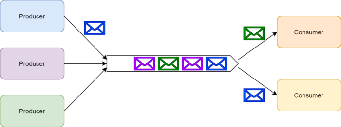
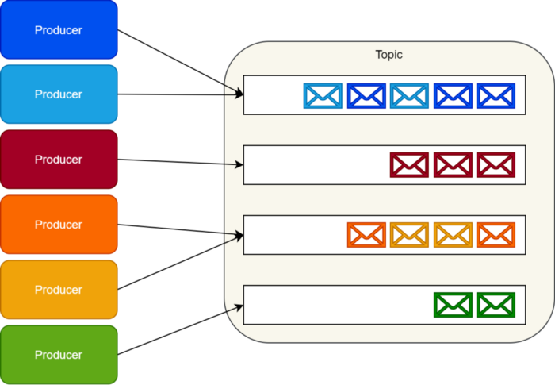
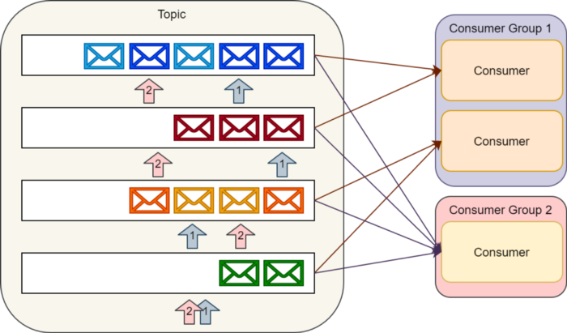

> 제목 : RabbitMQ vs. Kafka                                                                           
> 출처 : https://medium.com/better-programming/rabbitmq-vs-kafka-1ef22a041793

### 요약
대부분 RabbitMQ 와 Kafka 는 많은 상황에선 서로 대체가 가능하다고 생각하지만, 둘의 내부 구현은 전혀 다르게 되어 있으며 대체가 가능하지 않은 환경도 존재한다. 각각 장/단점이 있기 때문에, 두 플랫폼 간의 차이점을 알고 언제 어떤 플랫폼을 사용하는 것이 좋을지 신중하게 고려해서 선택해야 한다.

--- 

## 서론
소프트웨어 아키텍트로 여러 마이크로서비스 기반의 시스템을 다루면서, 종종  "RabbitMQ 와 Kafka 중 무엇을 써야할까?"라는 의문을 갖곤 한다. 
많은 개발자들은 이 기술들을 서로 대체가능하다고 생각한다. 대부분의 경우엔 옳지만, 두 플랫폼 간에는 다양한 차이점이 존재한다.

결과적으로 시나리오마다 다른 솔루션이 필요하고, 잘못된 솔루션을 고른다면  소프트웨어의 설계, 개발, 그리고 유지보수에 까지 치명적인 영향을 끼칠 수 있다.

이 글의 목표는 첫 번째로 기본적인 비동기 메시징 패턴을 소개하는 것이고,
다음으로 RabbitMQ 와 Kafka 그리고 둘의 내부 구조에 대하여 설명할 것이다.
Part 2에서는 두 플랫폼 간의 중요한 차이점, 각각의 장단점 그리고 어떻게 선택을 해야할 지에 대해 중점적으로 다룰 것이다.

## 비동기 메시징 패턴
비동기 메시징은 생산자에 의해 메시지가 만들어지고 소비자에 의해 처리되도록 분리시킨 메시징 구조라고 할 수 있다. 메시징 시스템을 다룰 때, _메시징 큐와 발행/구독_이라는 두 개의 주요한 패턴을 확인할 수 있다.

### 메시지 큐
메시징 큐 통신 패턴에서 큐는 소비자로부터 생산자를 일시적으로 분리시킨다. 다수의 생산자들은 동일한 큐로 메시지를 보낼 수 있다. 그러나, 소비자가 메시지를 처리하는 동안에는 메시지가 잠기거나 큐로부터 제거되고 더 이상 사용할 수 없게 된다. 단 하나의 소비자만이 특정 메시지를 취할 수 있는 것이다.

*메시징 큐*

참고로, 소비자가 특정 메시지 처리에 실패한다면 일반적으로 메시징 플랫폼은 다른 소비자를 위해 해당 메시지를 다시 원래 있던 큐로 되돌린다. 일시적인 분리 외에도, 큐는 처리 중 발생한 오류에 대해 어느 정도의 결함 허용성을 제공할 뿐만아니라 생산자와 소비자의 규모를 독립적으로 조정할 수 있게 해준다.

### 발행/구독
발생/구독(혹은 pub/sub) 통신 패턴에서 하나의 메시지는 다수의 구독자에 의해 동시에 수신 및 처리될 수 있다.

*발행/구독*

예를 들어, 이 패턴은 발행자가 모든 구독자에게 시스템에 어떤 일이 발생했음을 알려줄 수 있도록 해준다. 많은 큐잉 플랫폼들이 pub/sub 을 토픽이라는 용어와 연관지어 사용한다. RabbitMQ 에서는 토픽이 pub/sub 구현체 중의 하나의 특별한 유형이다 (a type of exchange to be exact). 그러나 이 글에서는 토픽을 pub/sub 에 관련하여 사용할 것이다.

일반적으로, 구독에는 다음과 같은 두 가지 유형이 있다.

1. 임시 구독 : 소비자가 실행 중인 동안에만 활성화되는 구독이다. 소비자가 종료되면 구독과 아직 처리되지 않은 메시지는 손실된다.

2. 영구 구독 : 명시적으로 삭제되지 않는 한 유지되는 구독이다. 소비자가 종료되어도 메시징 플랫폼이 구독을 유지하며, 메시지 처리는 나중에 재개할 수 있다. 

## RabbitMQ
RabbitMQ 는 메시지 브로커의 구현체이며(서비스 버스로 부르기도 한다), 태생적으로 위에서 설명한 두 메시징 패턴을 지원한다.
다른 유명한 메시지 브로커의 구현체로는 ActiveMQ, ZeroMQ, Azure Service Bus 그리고 Amazon Simple Queue Service (SQS) 등이 있다. 이 구현체들은 모두 공통되는 부분이 많다. 여기서 설명한 많은 개념들이 이들에게 대다수 적용된다.

### 큐
RabbitMQ 는 고전적인 메시징 큐잉을 지원한다. 개발자가 명명된 큐를 정의하면 발행자는 해당 큐에 메시지를 보낼 수 있고, 반대로 소비자는 같은 큐로부터 메시지를 읽어올 수 있다.

### 메시지 교환
RabbitMQ 는 메시지 교환을 사용하여 pub/sub 을 구현한다. 
발행자는 메시지의 구독자가 누구인지 몰라도 메시지 교환에 메시지를 발행한다.

메시지 교환을 구독하고자 하는 소비자가 큐를 생성한다. 
이후 메시지 교환은 소비자가 소비할 메시지를 큐에 넣는다.
다양한 라우팅 규칙을 기반으로 일부 구독자의 메시지를 필터링할 수도 있다.

*RabbitMQ 메시지 교환*

RabbitMQ 는 임시 구독과 영구 구독을 모두 지원한다. 소비자 RabbitMQ API 를 통해 원하는 구독 유형을 선택할 수 있다.

RabbitMQ 의 구조 덕분에, 하이브리드 접근 방식을 만들 수 있다. 즉, 일부 구독자들이 특정한 큐에서 경쟁하는 소비자의 형태로 메시지를 함께 처리하는 소비자 그룹을 구성한다. 이와 같은 방식으로 pub/sub 패턴을 구현하는 동시에 일부 구독자가 수신된 메시지를 처리할 수 있도록 규모를 확장하는 것 또한 허용한다.

*Pub/sub 과 큐잉의 결합*

## Apache Kafka
Apache Kafka 는 메시지 브로커의 구현이 아니라 분산 스트리밍 플랫폼이다.

큐와 교환에 기반하는 RabbitMQ 와는 다르게 Kafka 의 스토리지 레이어는 분할된 트랜잭션 로그를 이용하여 구현된다. 또한, Kafka 는 실시간으로 스트림 처리를 위한 Streams API 와 다양한 데이터 소스와 쉽게 통합할 수 있는 Connectors API 를 제공한다. 그러나, 이 부분들은 이 글의 범위를 벗어난다.

클라우드 공급 업체들은 Kafka 의 스토리지 레이어를 위한 대체 솔루션을 제공한다. Azure Event Hubs 그리고 어느정도 까지는 AWS Kinesis Data Streams 도 이러한 솔루션에 포함된다. Kafka 스트림 처리 능력에 대한 클라우드 전용 혹은 오픈 소스 대체재도 존재하나, 이 부분 또한 이 글의 범위를 벗어난다.

### Topics

Kafka 는 큐의 개념을 구현하지는 않고, 대신 토픽이라 불리는 카테고리 안에 레코드의 컬렉션을 저장한다.

각각의 토픽에 대해 Kafka 는 분할된 메시지 로그를 유지한다. 각 파티션은 순서가 있고 불변인 레코드의 시퀀스이며 메시지들이 계속해서 추가된다.

Kafka 는 메시지가 도착하는대로 파티션에 추가한다. 기본적으로 라운드 로빈 파티셔너를 사용하여 메시지를 파티션에 균일하게 분산시킨다.

생산자는 이 행동을 변경하여 메시지의 논리적인 스트림을 생성할 수 있다. 예를 들면, multitenant 애플리케이션에서 모든 메시지의 tenant 아이디에 따라 논리적인 메시지 스트림을 생성하고자 할 수도 있다. IoT 시나리오에서는 특정 파티션에 지속적으로 각 생산자의 식별자 맵을 만들기를 원할 수도 있다. 동일한 논리 스트림 맵으로부터 동일한 파티션으로 전송되는 모든 메시지가 소비자에게 전달되도록 보장한다.

*Kafka 생산자*

소비자는 이러한 파티션의 오프셋(혹은 인덱스)를 관리하고 순차적으로 읽음으로써 메시지를 소비한다.

단일 소비자는 다수의 토픽을 소비할 수 있고, 소비자는 사용 가능한 파티션의 수 또한 확장할 수 있다.

결과적으로 토픽을 생성할 때 해당 토픽에 대한 메시징의 예샹 처리량을 신경써서 고려해야 한다. 하나의 토픽을 함께 소비하는 소비자의 그룹을 소비자 그룹이라고 한다. Kafka API 는 일반적으로 소비자 그룹에서의 소비자 간의 파티션 처리 균형 조정 및 소비자의 현재 파티션 오프셋 저장을 처리한다.

*Kafka 소비자*

### Kafka 로 메시징 패턴 구현하기

Kafka 의 구현은 pub/sub 패턴에 아주 잘 대응된다.

생산자는 특정 토픽에 메시지를 보낼 수 있고, 다수의 소비자 그룹은 같은 메시지를 소비할 수 있다. 각 소비자 그룹은 개별적으로 확장하여 로드를 처리할 수 있다. 소비자는 자신의 파티션 오프셋을 유지 관리하기 때문에, 재시작 후에도 오프셋을 유지하는 영구 구독과 매번 시작할 때 마다 각 파티션의 최신 레코드로부터 재시작하는 임시 구독 중 선택할 수 있다.

그러나, 이건 메시지 큐 패턴에는 적합하지 않다. 물론, 토픽에 단일 소비자 그룹을 사용하여 고전적인 메시지 큐잉을 에뮬레이트 할 수는 있지만, 여러 단점이 존재한다. 한참 후 이 글의 Part 2에서 논의할 것이다.

Kafka 는 소비자가 메시지들을 소비했는지와는 관계 없이 미리 설정된 기간까지 파티션 내에 메시지를 보관한다. 이 보존은 과거의 메시지를 자유롭게 다시 읽을 수 있음을 의미한다. 게다가 개발자는 이벤트 소싱 및 감사용 로그와 같은 메커니즘을 Kafka 의 스토리지 레이어를 사용하여 구현할 수 있다.

## 마무리

때때로 RabbitMQ 와 Kafka 는 서로 대체가 가능하긴 하지만, 둘의 구현 방식은 아주 다르다. 결과적으로, 그것들은 같은 카테고리에 속하는 도구로 볼 수 없다. 하나는 메시지 브로커이고, 다른 하나는 분산 스트리밍 플랫폼인 것이다.

솔루션 아키텍트로서 이러한 차이점을 인정해야하고 주어진 시나리오에서 어떤 유형의 솔루션을 사용해야하는지 적극적으로 고려해야 한다. Part 2 에서는 이러한 차이점과 각각 언제 사용해야할지에 대한 가이드를 제공할 것이다.