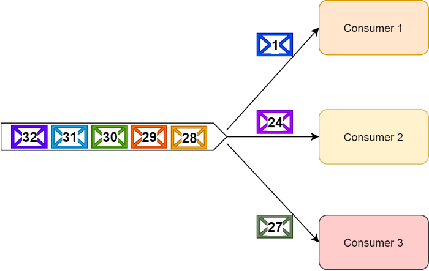
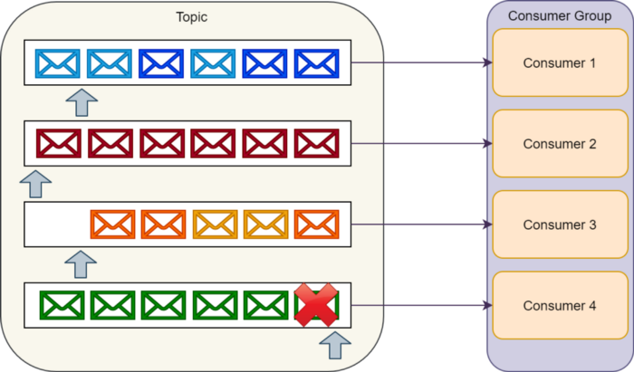
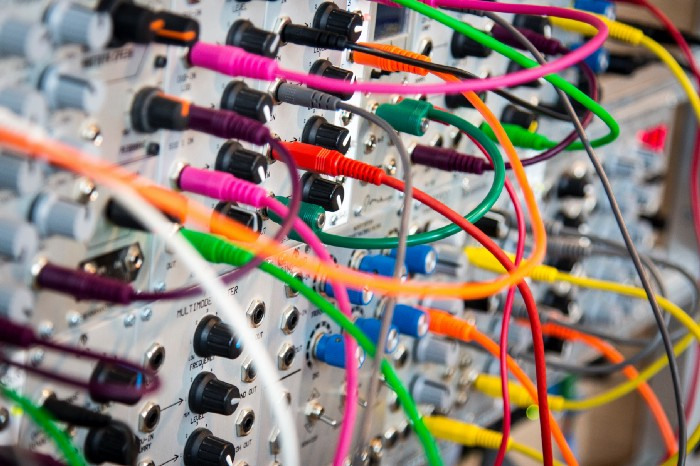
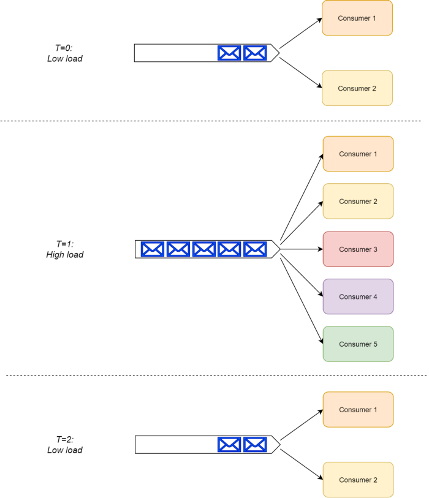
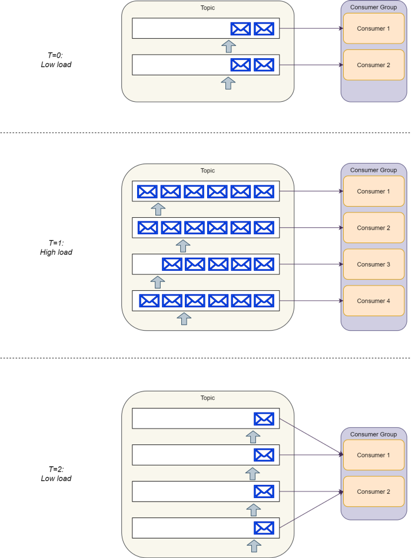

> 제목 : RabbitMQ vs. Kafka: Head-To-Head                                                                           
> 출처 : https://medium.com/better-programming/rabbitmq-vs-kafka-1779b5b70c4

--- 

[이전글](../2020-08-05/RabbitMQ_vs_Kafka_part2_1.md)에 이어서 작성함

### 결함 처리

메시지와 큐 그리고 이벤트를 다룰 때, 개발자는 종종 메시지가 항상 성공한다는 인상을 받는다. 결국 생산자는 각각의 메시지를 큐 혹은 토픽에 배치 하기 때문에 소비자가 메시지 처리에 실패하더라도 성공할 때 까지 간단히 재시도할 수 있다.

표면적으로는 사실이지만, 우리는 이 과정에 더 많이 고려해봐야 한다.
일부 시나리오에서는 메시지 처리가 실패할 수 있음을 인정할 필요가 있다. 심지어 해결책이 사람의 개입이 일부 필요하더라도 우리는 이러한 상황들을 우아하게 다뤄야 한다.

메시지 처리를 할 때 발생 가능한 오류에는 두 가지 종류가 있다:

1. 일시적인 실패: 네트워크 연결, CPU 로드 혹은 서비스 충돌 등 일시적인 이슈로 발생한 실패. 이러한 유형의 실패는 여러 번 재시도함으로써 완화할 수 있다.

2. 지속적인 실패: 추가적인 재시도로는 해결할 수 없는 지속적인 이슈로 발생하는 실패. 이러한 실패의 공통 원인은 소프트웨어 버그 혹은 잘못된 메시지 스키마이다. (예: 독성 메시지)

아키텍트 혹은 개발자로서 우리는 스스로에게 물어야 한다: "메시지 처리에 실패하면 몇 번이나 재시도를 해야할까? 재시도 사이에 얼마나 대기해야 할까? 일시적인 오류와 지속적인 오류를 어떻게 구별할까?"

그리고 가장 중요한 것은 "재시도가 모두 실패하거나 지속적인 실패가 발생하면 어떻게 해야할까?"

이러한 질문에 대한 답은 도메인에 따라 다르지만, 메시징 플랫폼은 일반적으로 솔루션을 구현할 수 있는 도구를 제공한다.

RabbitMQ 는 메시지 처리 실패를 처리할 수 있도록 전송 재시도 혹은 데드 레터 교환(DLX, Dead-Letter Exchange)과 같은 도구를 제공한다.

DLX 의 주요 아이디어는 RabbitMQ 가 설정에 기반하여 실패한 메시지를 DLX 로 자동적으로 라우팅 및 지연된 재시도, 재시도 횟수, "사람의 개입" 큐로의 전달 등의 DLX 에서의 추가적인 메시지 처리 규칙을 적용한다는 점이다.

이 문서에서는 RabbitMQ 에서의 재시도 처리를 위한 가능한 패턴에 대한 추가적인 정보를 제공한다.

여기서 기억해야 할 가장 중요한 것은 RabbitMQ 에서 소비자가 특정 메시지를 처리하거나 재시도를 하느라 바쁠 때 (심지어 큐에 메시지를 반환하기 전에도), 다른 소비자가 뒤따라오는 메시지를 동시에 처리할 수 있다는 것이다.

특정 소비자가 특정 메시지에 대한 처리를 재시도 하는 중에도 전체 메시지 처리는 멈추지 않는다. 결과적으로, 메시지 소비자는 전체 시스템에 영향을 주지 않으면서 동기적으로 메시지 처리를 다시 시도 할 수 있다.

*다른 소비자가 메시지를 처리하는 동안, 소비자 1은 메시지 1을 계속해서 재시도할 수 있다.*

RabbitMQ 와는 대조적으로, Kafka 는 즉시 사용([out of the box](https://web-front-end.tistory.com/84))이 가능한 이러한 메커니즘을 제공하지 않는다. Kafka 를 사용하여 애플리케이션 레벨에서 메시지 재시도 메커니즘을 제공하고 구현함은 우리에게 달려있다.

또한, 소비자가 특정 메시지를 동기적으로 재시도하는 중일 때, 같은 파티션의 다른 메시지들은 처리할 수 없다.

소비자가 메시지의 순서를 변경할 수 없기 때문에 특정 메시지를 반려 혹은 재시도하고 뒤따라오는 메시지를 커밋할 수는 없다, 알다시피 파티션은 단순히 덧붙이기만 가능한 로그이다.

애플리케이션 레벨 솔루션은 실패한 메시지를 "재시도 토픽"에 커밋하고 거기서 재시도 처리를 할 수 있다. 그러나, 이 솔루션에서는 메시지의 순서를 잃게 된다.

이러한 구현 예제는 Uber.com 에서 확인할 수 있다.
만약 메시지 처리 지연시간이 이슈가 아닌 경우에는 적절한 오류 모니터링 기능이 있는 바닐라 Kafka 솔루션으로도 충분할 수 있다.

*소비자가 메시지 재시도를 중단하면 하단 파티션의 메시지는 처리되지 않는다*

#### 승자
RabbitMQ 가 별도의 설정없이 이러한 문제를 해결하기 위한 메커니즘을 제공하기 때문에 승자이다.

### 스케일

RabbitMQ 와 Kafka 의 성능을 검사하는 다양한 벤치마크들이 있다.

일반적인 벤치마크는 특정한 사례에 대한 적용 가능성으로 한정되어 있지만, Kafka 는 일반적으로 RabbitMQ 보다 성능이 더 나은걸로 간주된다. Kafka 는 성능 향상을 위해 순차적인 디스크 입출력을 사용한다.

파티션을 사용하는 이 구조는 수직적으로 스케일을 키우는(scale-up) RabbitMQ 보다 수평적으로 더 잘 스케일을 확장(cale-out)있다는 것을 의미한다.

대규모의 Kafka deployments 는 일반적으로 초당 수십만개의 메시지를, 심지어 초당 수백만개의 멧지ㅣ를 처리할 수 있다.

과거에 Pivotal 은 초당 백만개의 메시지를 처리하는 RabbitMQ 클러스터를 기록했다. 그러나, 그건 30개 노드 클러스터에서 다수의 큐와 교환에 최적으로 부하를 분산시켜 수행했던 것이다.

전형적인 RabbitMQ deployments 는 큐 사이에 필수적으로 로드를 최적으로 나누지 않아도 되는 3~7개의 노드 클러스터를 포함한다. 이러한 일반적인 클러스터는 초당 수만개의 메시지 부하를 처리할 수 있을 걸로 기대된다.

#### 승자

두 플랫폼 모두 대규모의 부하를 처리할 수 있지만, Kafka 는 일반적으로 더 나은 확장성을 갖고 RabbitMQ 보다 더 높은 처리량을 달성할 수 있다. 그러므로 이번 라운드에선 Kafka 의 승리다.

그러나 중요한건, 대다수의 시스템에서는 이러한 한계에 도달하지 않는다는 점을 유의해야한다! 그러므로 수백만명의 사용자에게 큰 인기를 끄는 소프트웨어 시스템을 만들지 않는 한, 두 플랫폼 모두 잘 지원을  하므로 스케일 확장에 그렇게까지 신경쓸 필요는 없다.

### 소비자 복잡도

RabbitMQ 는 똑똑한 브로커와 멍청한 소비자 접근법을 사용한다. 소비자는 소비 큐에 등록하고, RabbitMQ 는 처리할 메시지가 들어오면 큐에 메시지를 푸시한다. RabbitMQ 에는 또한 pull API가 있으나, 많이 사용하진 않는다.

RabbitMQ 는 소비자에게 메시지 배포 및 큐에서 메시지 제거(DLX로)하는 작업을 관리한다. 소비자는 이에 대해 걱정할 필요가 없다.

또한 RabbitMQ 의 구조는 부하가 증가할 때도, 시스템의 어떤 변경도 없이 큐의 소비자 그룹을 단 한명의 소비자에서 다수의 소비자들로 효율적으로 규모를 확장할 수 있음을 의미한다.

*RabbitMQ 소비자는 효율적으로 Scale-up 및 Scale-down 한다*

반대로 Kafka 는 멍청한 브로커와 똑똑한 소비자 접근법을 사용한다. 소비자 그룹 내의 소비자는 그들 사이의 토픽 파티션에 대한 리스를 조정해야한다. (소비자 그룹의 한 소비자만이 특정한 파티션을 구독하도록)

소비자는 그들의 파티션의 오프셋 인덱스를 관리 및 저장해야 한다. 다행히 Kafka SDK 가 이러한 작업을 수행하므로 직접 관리할 필요는 없다.

또한, 부하가 증가함에 따라 단지 토픽 내의 파티션의 수와 소비자의 수가 동일해지는 지점까지 소비자 그룹의 규모를 확장할 수 있다. 그 위로는 추가 파티션을 더하기 위해 Kafka 를 설정해야 한다.

그러나, 다시 부하가 감소하더라도 이미 추가한 파티션은 제거할 수 없으므로, 소비자가 해야하는 일이 더 많아진다. 위에서 언급했지만 이 SDK 는 추가적인 작업을 처리한다.

*Kafka 파티션은 제거되지 않는다. 규모 축소 후 소비자가 더 많은 작업을 할 수 있다*

#### 승자
설계적으로 RabbitMQ 는 멍청한 소비자를 염두에 두고 만들어졌다. 결과적으로 이번 라운드에서는 RabbitMQ 의 승리다.

## 언제 뭘 사용할까?
이제 우리는 백만 불 짜리 질문에 직면했다. "언제 RabbitMQ 를 사용하고, 언제 Kafka 를 사용할까?"

위 차이점들을 요약하면, 다음과 같은 결론에 도달한다.

RabbitMQ 는 다음이 필요할 때 선호된다:

1. 고급적이고 유연한 라우팅 규칙
2. 메시지 타이밍 제어 (메시지 만료 혹은 메시지 지연 제어)
3. 소비자가 일시적으로 또는 영구적으로 메시지 처리에 실패할 가능성이 높은 경우, 고급 오류 처리 기능
4. 더 간단한 소비자 구현체

Kafka 는 다음이 필요할 때 선호된다:

1. 엄격한 메시지 순서
2. 지난 메시지를 재생할 가능성을 포함하여 장기간 메시지를 보존
3. 전통적인 솔루션으로는 충분하지 않을 때 높은 규모에 도달할 수 있는 능력

두 플랫폼을 모두 사용하여 대부분의 사용 사례는 구현할 수 있다. 그러나, 작업에 가장 적합한 도구를 선택하는 것은 솔루션 아키텍트로서의 우리에게 달려있다. 이 선택을 할 때, 위에서 강조한 기능적인 차이와 비 기능적인 제약조건을 모두 고려해야 한다.

이러한 제약에는 다음과 같은 것이 포함된다:

1. 이러한 플랫폼에 대한 기존 개발자의 지식
2. 해당되는 경우 관리형 클라우드 솔루션의 가용성
3. 각 솔루션의 운영 비용
4. target stack 을 위한 SDK 의 가용성.

복잡한 소프트웨어 시스템을 개발할 때, 동일한 플랫폼을 사용하여 필요한 모든 메시징 사용 사례를 구현하고 싶을 수 있다. 그럼에도 불구하고, (저자의)경험상 두 플랫폼을 모두 사용하면 큰 이점을 얻을 수 있다.

예를 들어, 이벤트 기반 아키텍처 기반 시스템에서 RabbitMQ 를 사용하여 서비스 간에 명령을 보내고 Kafka를 사용하여 비즈니스 이벤트 알림을 구현할 수 있습니다.

그 이유는 이벤트 알림이 이벤트 소싱, 배치 작업에 자주 사용되거나 감사 목적으로 필요하기 때문에 Kafka 는 메시지 보존 기능에 매우 유용하다.

반면에 명령은 일반적으로 소비자 측에서 추가처리를 필요로 하며, 처리를 실패할 수도 있고 고급 오류 처리 기능이 필요하다.

여기서 RabbitMQ 는 그 기능으로 빛난다. 나중에 자세한 게시물을 작성할 수도 있지만, 기억해야 한다. 적합성은 특정 요구사항에 따라 다르기 때문에 마일리지가 다를 수 있다.

## 마치며
나는 많은 개발자들이 RabbitMQ 와 Kafka 를 서로 바꿔서 사용할 수 있다고 생각한다는 관찰을 바탕으로 이번 두 개의 포스트 시리즈를 시작했다. 이 게시물을 검토하는 것이 이러한 플랫폼의 구현과 이들 간의 기술적 차이점에 대한 통찰력을 얻는 데 도움이 되었기를 바란다.

그 차이는 이러한 플랫폼이 잘 작동하는 사용 사례에 영향을 미친다. 두 플랫폼 모두 훌륭하며 여러 사용 사례를 제공할 수 있다.

그러나, 솔루션 아키텍트로서 각 사용사례의 요구사항을 이해하고 우선 순위를 정하고 가장 적합한 솔루션을 선택하는 것은 우리에게 달려있다.