# 시니어 프런트 엔드 개발자처럼 Chrome DevTools 사용
11 tips you must know if you choose Chrome as your development environment.
> 제목 : Use Chrome DevTools Like a Senior Frontend Developer
> 글쓴이 : bitfish  
> [https://medium.com/javascript-in-plain-english/use-chrome-devtools-like-a-senior-frontend-developer-99a4740674 ](https://medium.com/javascript-in-plain-english/use-chrome-devtools-like-a-senior-frontend-developer-99a4740674)


어떤 이유로든 개발중인 브라우저로 Chrome을 선택했습니다. 그런 다음 개발자 도구를 열고 코드 디버깅을 시작합니다.

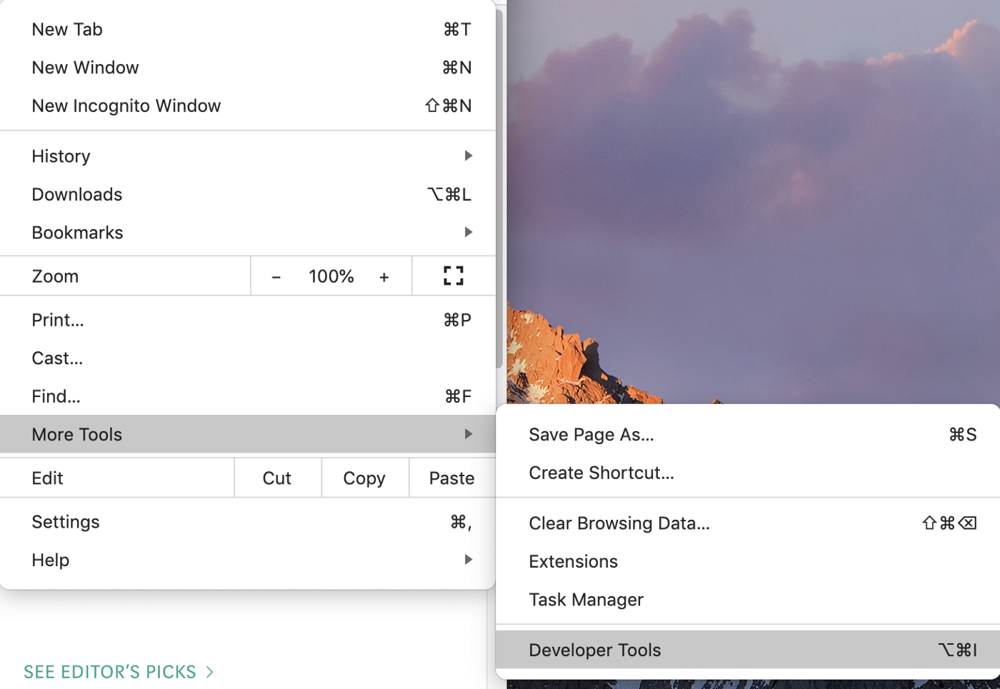

때때로 콘솔 패널을 열어 프로그램의 출력을 확인하거나 요소 패널을 열어 DOM 요소의 CSS 코드를 확인합니다.

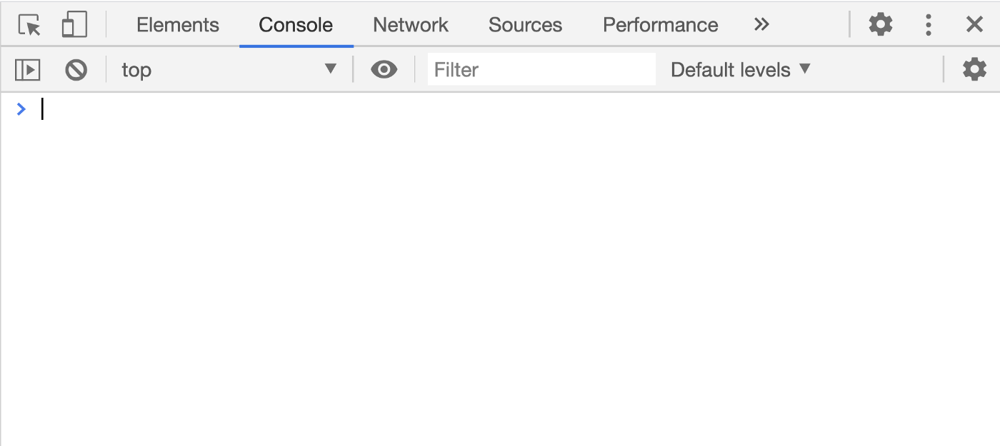

하지만 Chrome DevTools를 정말로 이해하고 있습니까? 사실, 그것은 우리의 개발 효율성을 크게 향상시킬 수 있는 강력하지만 알려지지 않은 많은 기능을 제공합니다.

여기에서는 가장 유용한 기능을 소개하여 도움을 드리고자합니다.

시작하기 전에 Command 메뉴를 소개하겠습니다. 명령 메뉴는 Chrome에 대한 쉘은 Linux에 대한 것입니다. 명령 메뉴를 사용하면 몇 가지 명령을 입력하여 Chrome을 조작 할 수 있습니다.
먼저 Chrome 개발자 도구를 열고 다음 바로 가기를 사용하여 명령 메뉴를 엽니다.

- windows ： Ctrl + Shift + P
- macOS ： Cmd + Shift + P 
 
또는 아래 버튼을 클릭하여 열 수 있습니다.

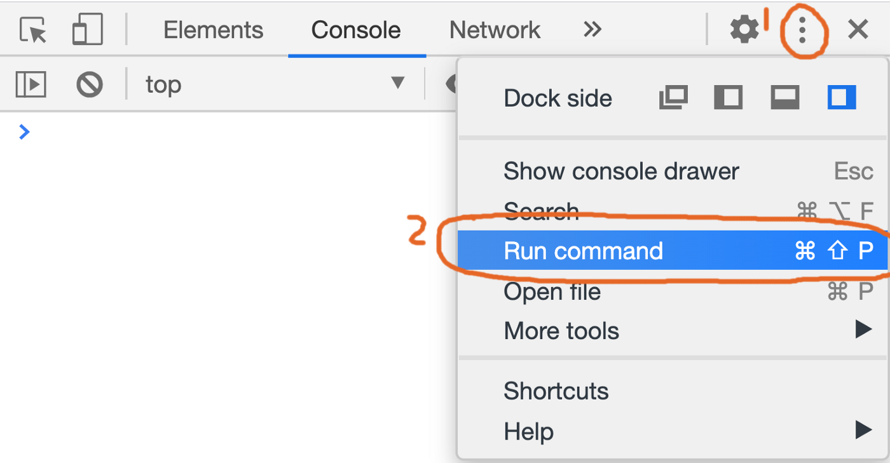

그런 다음 다양한 강력한 기능을 수행하기 위해 선택할 수있는 다양한 명령이있는 명령 패널로 이동할 수 있습니다.

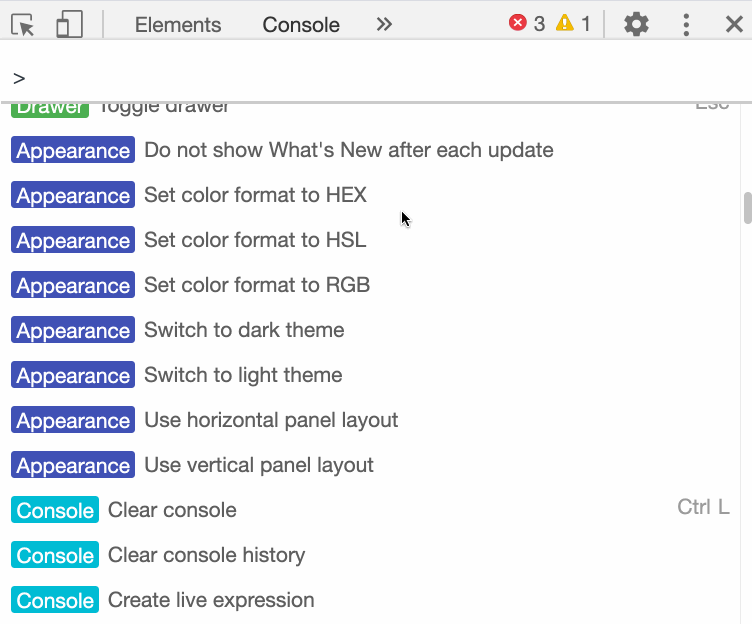

## **강력한 스크린 샷(Powerful screenshots)**

화면의 일부를 캡처하는 것은 매우 일반적인 요구 사항이며 현재 컴퓨터에 매우 편리한 스크린 샷 소프트웨어가 이미 있다고 확신합니다. 하지만 다음 작업을 완료 할 수 있습니까?

- 시각적 창에 표시되지 않는 모든 항목을 포함하여 웹 페이지에있는 모든 항목의 스크린 샷 
- DOM 요소의 내용을 정확하게 캡처 

이는 일반적인 요구 사항이지만 운영 체제와 함께 제공되는 스크린 샷 도구를 사용하여 쉽게 해결할 수 없습니다. 이 시점에서 명령을 사용하여이 요구 사항을 완료 할 수 있습니다.

해당 명령은 다음과 같습니다.

- 스크린 샷 전체 ​​크기 스크린 샷 캡처 
- 스크린 샷 캡처 노드 스크린 샷 

### **Example**
이제 웹 페이지 (예 : Medium의 JavaScript에 대한 주요 기사 페이지)를 엽니 다. https://medium.com/tag/javascript

>그리고 명령 메뉴를 열고 입력합니다. <br>
**Screenshot Capture full size screenshot**

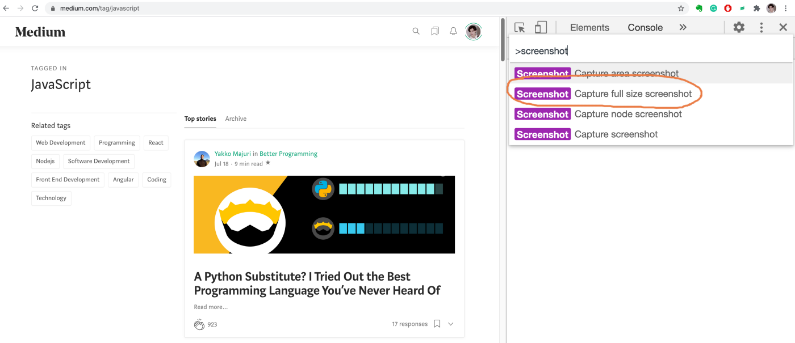

그러면 현재 페이지의 전체 스크린 샷을 얻을 수 있습니다.

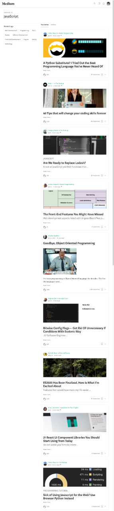

*위의 원본 이미지는 매우 명확하지만 여기에 트래픽을 절약하기 위해 압축 된 이미지를 업로드했습니다.*

마찬가지로 DOM 요소의 스크린 샷을 찍으려면 시스템의 자체 스크린 샷 도구를 사용할 수 있지만 요소를 정확히 캡처 할 수는 없습니다. 이 시점에서 다음 명령어를 사용할 수 있습니다. 
```
Capture node screenshot
```

먼저 요소 패널에서 요소를 선택한 다음 명령을 실행합니다.

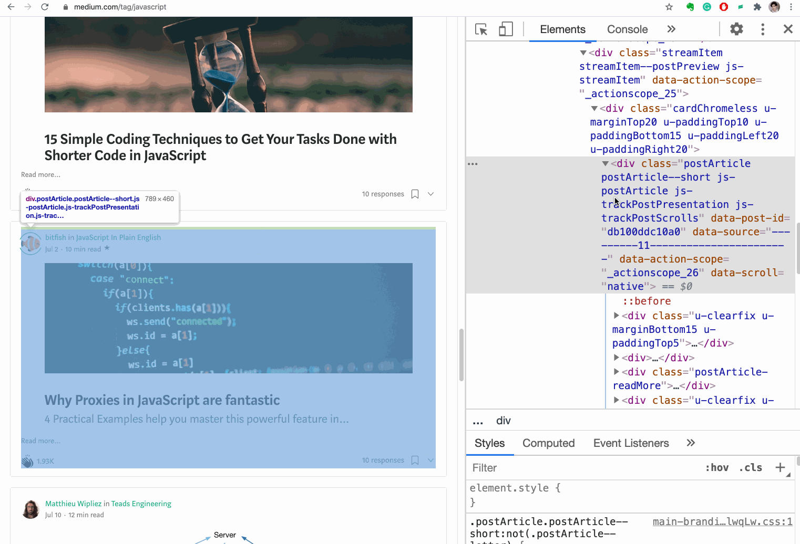

이것은 정확한 스크린 샷의 결과입니다.

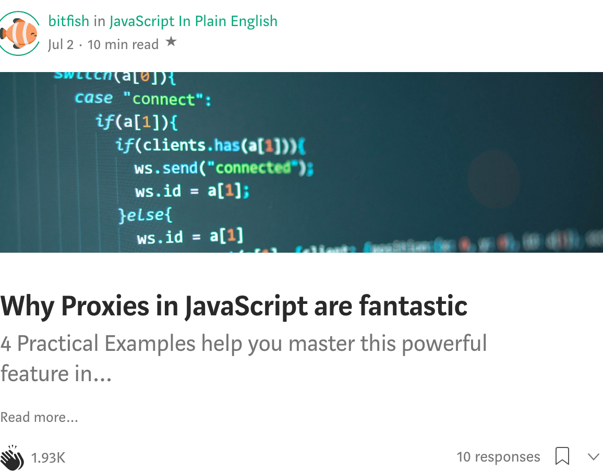

## **콘솔에서 마지막 작업의 결과 참조**
종종 콘솔에서 코드를 디버그해야합니다. JavaScript에서 문자열을 뒤집는 방법을 알고 싶고 웹에서 관련 정보를 검색하고 다음 코드 줄을 찾는다고 가정합니다.
```
'abcde'.split (' '). reverse (). join (' ')
``` 

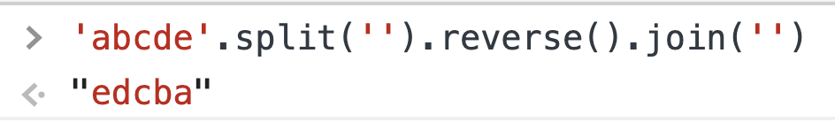

위의 코드는 문자열을 뒤집습니다. 그러나 여전히 split() reverse() join() 메서드가 수행하는 작업과 이러한 중간 단계를 실행 한 결과를 알 수 없습니다. 이제 위의 코드를 단계별로 실행하려면 다음과 같이 작성할 수 있습니다.

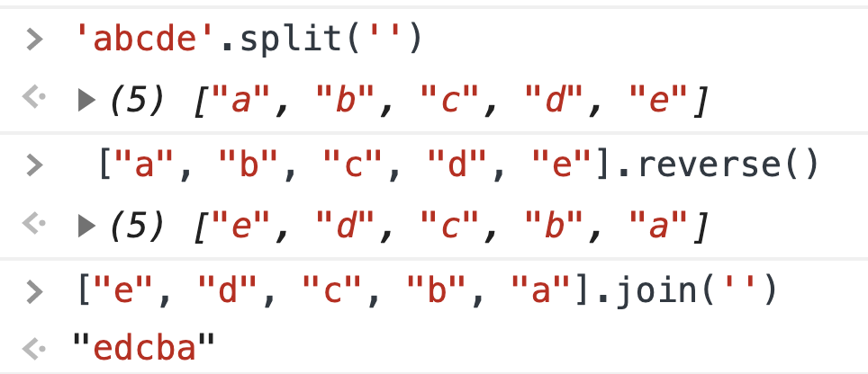

이 단계 후에 우리는 각 메소드 실행의 반환 값을 알고 있습니다.

그러나 이것은 매우 중복(redundant)됩니다. 오류가 발생하기 쉽고 이해하기 어렵습니다. 실제로 콘솔에서 매직 변수 `$_`를 사용 하여 이전 작업의 결과를 참조 할 수 있습니다.

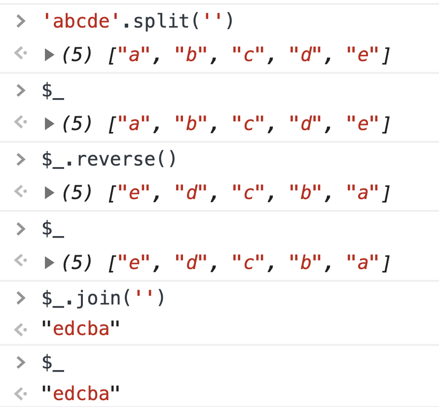

`$_`값이 항상 콘솔에서 마지막 작업의 결과와 같은 특수 변수입니다. 이 기술은 코드를 디버그하는 편리한 방법입니다.

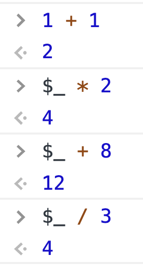

## **XHR 요청 다시 보내기**
프런트 엔드 프로젝트에서는 종종 XHR을 사용하여 데이터를 얻기 위해 백엔드에 요청해야합니다. XHR 요청을 다시 보내려면 어떻게해야합니까?

초보자의 경우 페이지를 새로 고칠 수 있지만 이는 번거로울 수 있습니다. 실제로 네트워크 패널에서 직접 디버깅 할 수 있습니다.

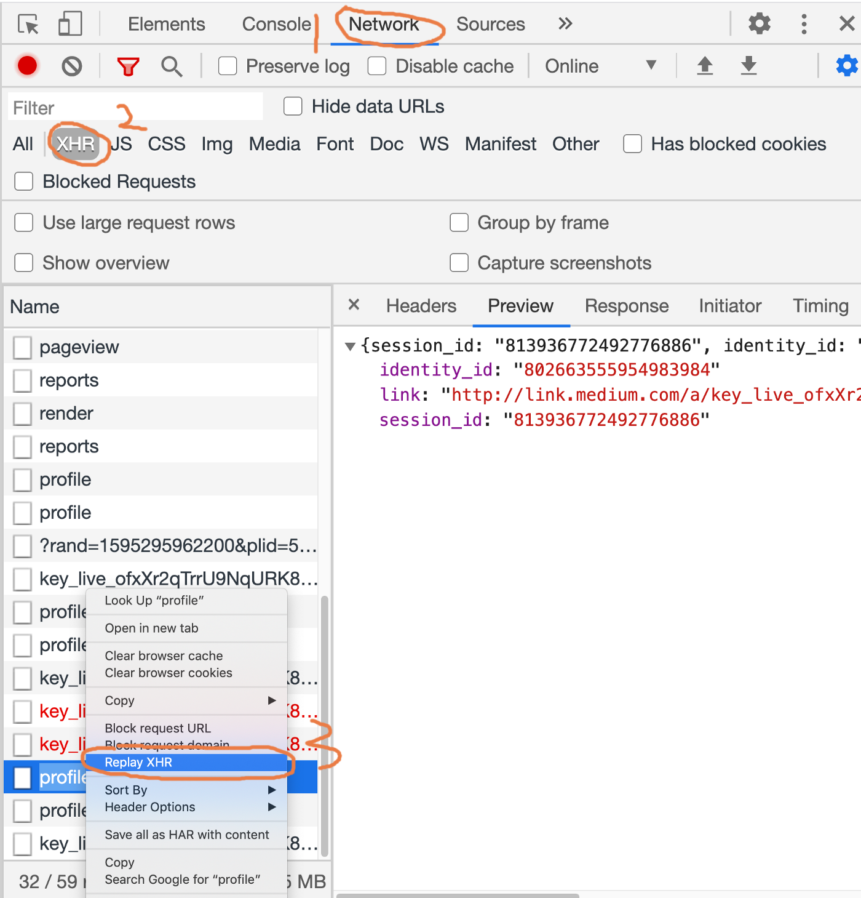

- 네트워크 패널 열기 
- XHR 버튼 클릭 
- 다시 보낼 XHR 요청을 선택하십시오. 
- XHR 재실행
 
다음은 gif 예입니다.

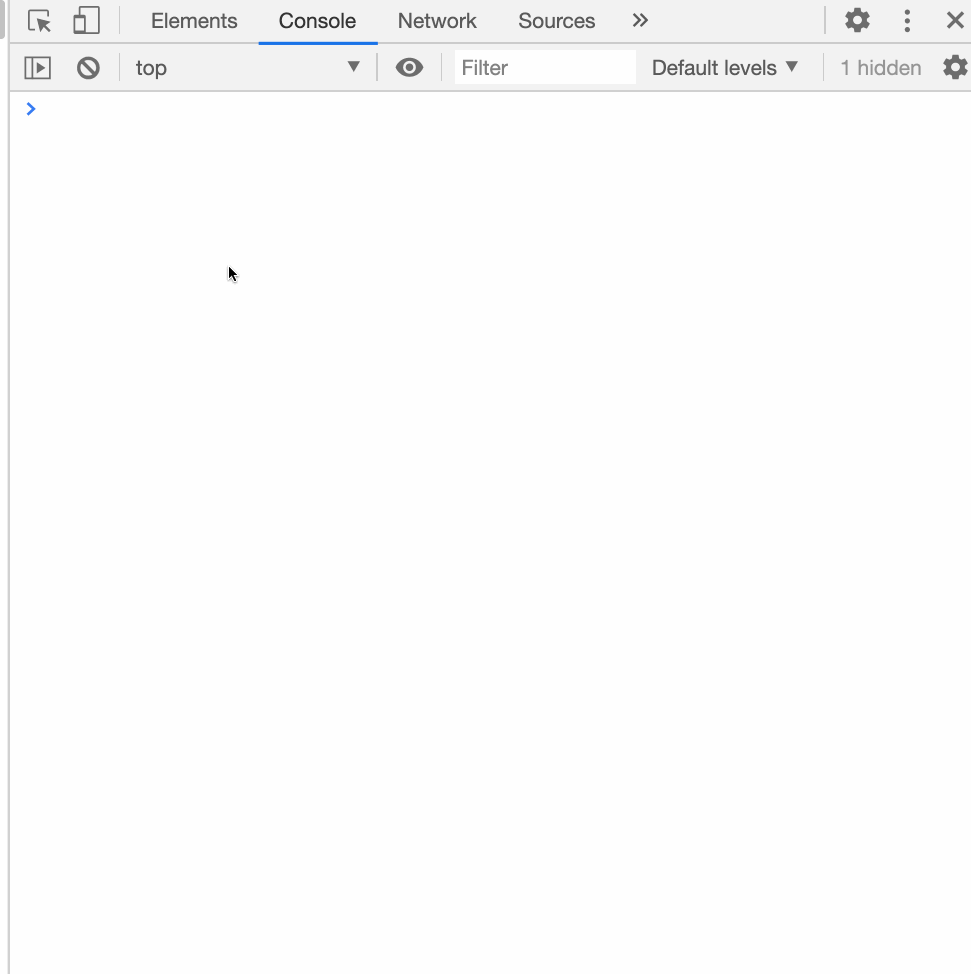

## **페이지로드 상태 모니터링**
페이지가 처음부터 완전히로드되는 데 10 초 이상 걸릴 수 있습니다. 여기에서 페이지가 다른 시간에로드되는 방식을 모니터링해야합니다.

Chrome DevTools에서 우리는 `Capture Screenshots`를 이용해 네트워크 패널 페이지 로딩의 스크린 샷을 캡처 할 수 있습니다.

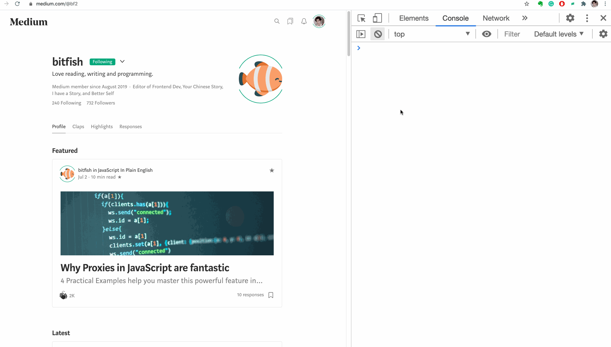

각 스크린 샷을 클릭하면 해당 시간에 네트워크 요청이 표시됩니다. 이 시각적 프리젠테이션은 매 순간 발생하는 네트워크 요청에 대한 더 나은 아이디어를 제공합니다.

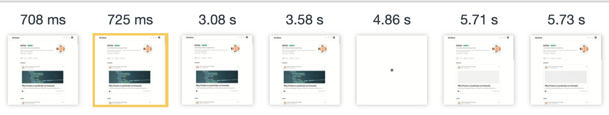

## **변수 복사**
JavaScript 변수의 값을 다른 곳에 복사 할 수 있습니까?

불가능한 작업처럼 보일 수 있지만 Chrome copy에는 변수를 복사하는 데 도움이 되는 함수 가 있습니다.

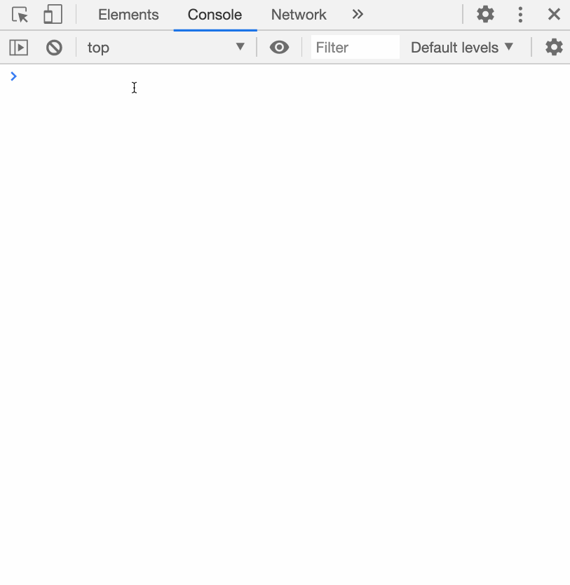

이 copy기능은 ECMAScript에서 정의하지 않지만 Chrome에서 제공합니다. 이 함수를 사용하면 JavaScript 변수의 값을 클립 보드에 복사 할 수 있습니다.

## **이미지를 데이터 URI로 복사**
페이지에서 이미지를 처리하는 방법에는 두 가지가 있습니다. 하나는 외부 리소스 링크를 통해로드하는 것이고 다른 하나는 이미지를 데이터 URL 로 인코딩하는 것 입니다.
>***Data URLs**, `` data: ``스미마가 접두사로 붙은 URL을 사용하면 콘텐츠 작성자가 작은 파일을 문서에 인라인으로 포함 할 수 있습니다. WHATWG에서 해당 이름을 폐기 할 때까지 이전에는 "데이터 URI"로 알려졌습니다.*

이러한 작은 이미지를 데이터 URL로 코딩하고이를 코드에 직접 삽입하면 페이지에서 만들어야하는 HTTP 요청 수가 줄어들어 페이지로드 속도가 빨라집니다.

그렇다면 Chrome에서 이미지를 데이터 URL로 어떻게 바꾸나요?

다음은 gif입니다.

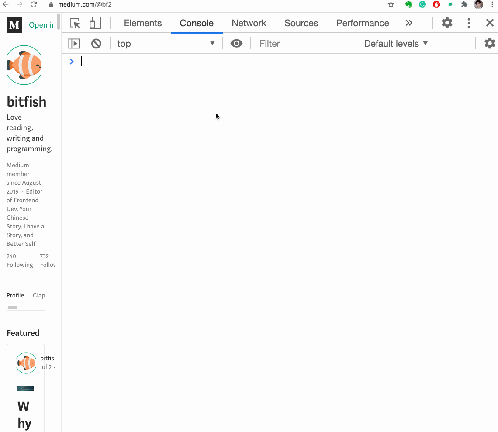

## **테이블 객체 배열**
다음과 같은 객체 배열이 있다고 가정합니다.
```
let users = [{name : 'Jon', age : 22}, 
  {name : 'bitfish', age : 30}, 
  {name : 'Alice', age : 33}]
```
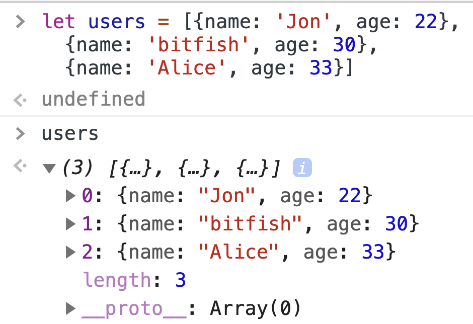

이러한 배열은 콘솔에서보기가 쉽지 않습니다. 배열이 더 길고 요소가 더 복잡하면 이해하기가 더 어려워집니다.

다행히 Chrome은 객체 배열을 표로 만드는 테이블 함수를 제공합니다.

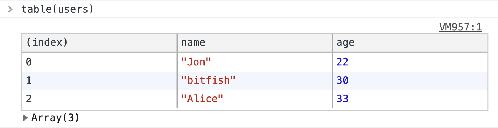

많은 경우에이 기능은 매우 유용합니다.

## **요소 패널에서 드래그 앤 드롭**
UI를 테스트하기 위해 페이지에서 특정 DOM 요소의 위치를 ​​조정하려는 경우가 있습니다. 요소 패널에서 HTML 요소를 드래그 앤 드롭하고 페이지에서 위치를 변경할 수 있습니다.


위의 git에서 요소 패널에서 div의 위치를 ​​드래그했고 웹 페이지에서의 위치가 동 기적으로 변경되었습니다.

## **콘솔에서 현재 선택된 요소 참조**
`$0`은(는) 요소 패널에서 현재 선택된 요소를 참조하는 또 다른 매직 변수입니다.

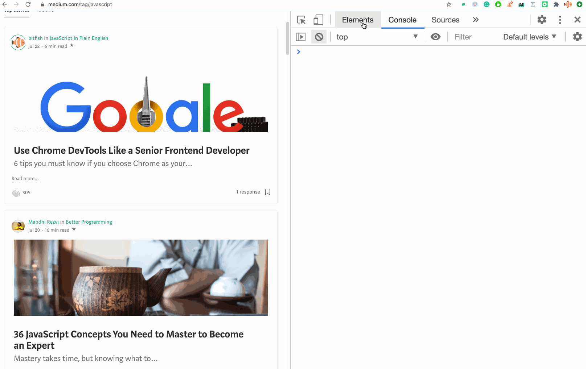

## **CSS 의사 클래스 트리거**
> *의사 클래스(Pseudo-classes)를 사용하면 문서 트리의 내용뿐만 아니라 탐색기의 기록 ( 예 :`:visited`) , 내용의 상태 (예 : `:checked` ) 와 같은 외부 요소와 관련하여 요소에 스타일을 적용 할 수 있습니다. 또는 마우스의 위치 (예: `hover:` 마우스가 요소 위에 있는지 여부를 알 수 있음).*

하나의 요소에 대해 여러 가상 클래스를 작성할 수 있으며 이러한 스타일을 쉽게 테스트 할 수 있도록 요소 패널에서 직접 이러한 스타일을 트리거 할 수 있습니다.

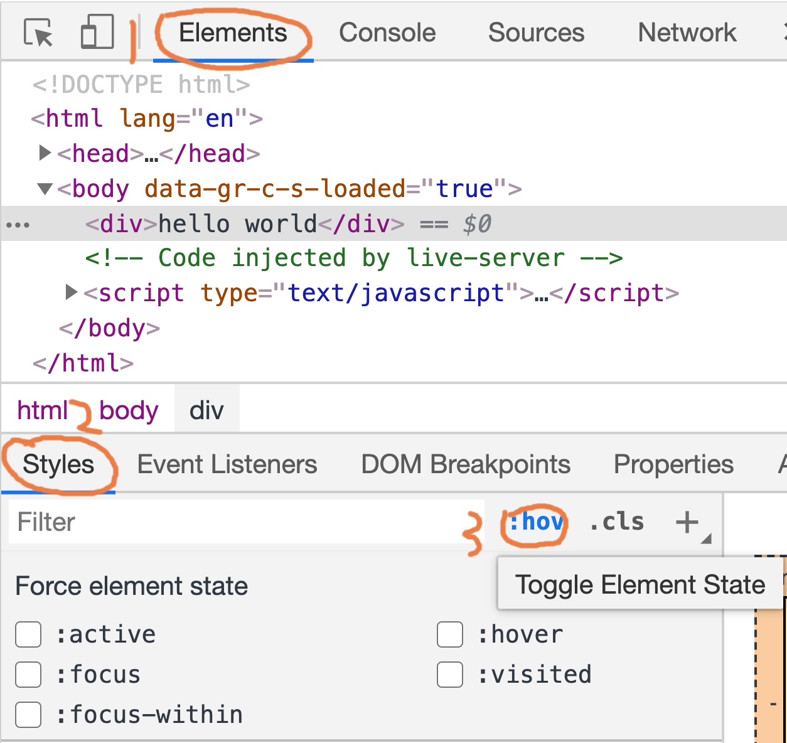

## Example
다음은 웹 페이지입니다.

그런 다음 브라우저에서 열고 요소 패널을 통해 의사 클래스 스타일을 디버그합니다.

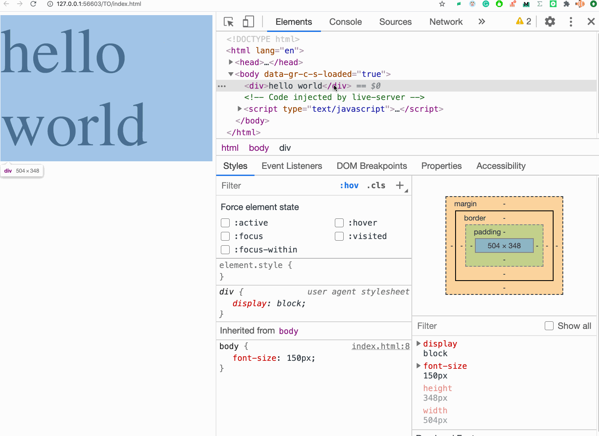

## **요소 숨기기 단축키**
CSS 스타일을 디버깅 할 때 종종 요소를 숨겨야합니다. 요소를 선택하고 `H`키보드를 누르면 빠르게 요소를 숨길 수 있습니다.

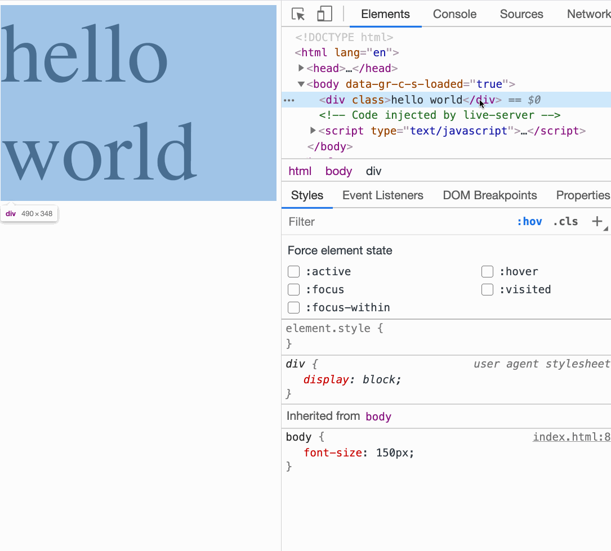

이 작업은 `visibility: hidden !important;`해당 요소에 스타일 을 추가하는 것 입니다.

## **전역 임시 변수에 DOM 요소 저장**
콘솔에서 DOM 요소 참조를 빠르게 얻으려면 다음과 같이 할 수 있습니다.
- 요소 선택 
- 마우스 오른쪽 클릭 
- 전역 변수로 저장 


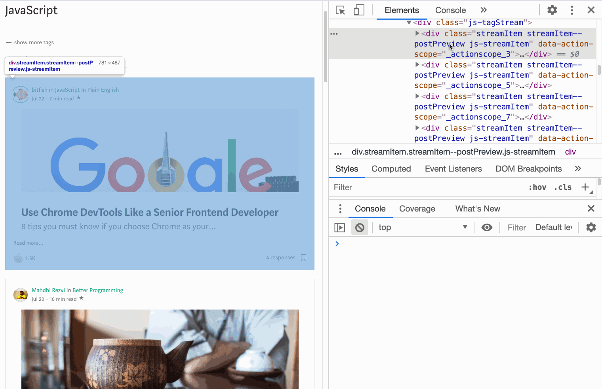